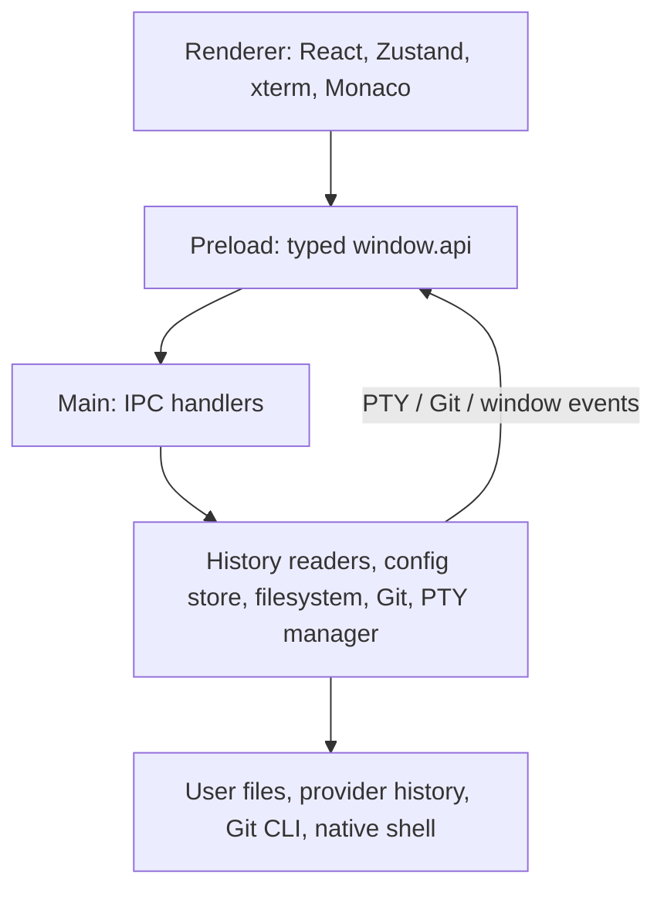

# Parallel Agents — Architecture

This is an implementation map, not a claim of live runtime verification. The current source and
[package.json](package.json) are authoritative for behavior, versions, and scripts.
[SPEC.md](SPEC.md) records product intent and contains historical descriptions.
See [CONTRIBUTING.md](CONTRIBUTING.md) for setup and validation.

## Process boundaries

- [src/main/index.ts](src/main/index.ts) owns the BrowserWindow, tray, fullscreen shortcut, and quit
  lifecycle. Closing the window normally hides it. Quitting detaches event targets, closes Git
  watchers, and kills PTYs.
- [src/preload/index.ts](src/preload/index.ts) exposes `window.api` through `contextBridge`.
  Requests use `ipcRenderer.invoke`; event subscriptions return unsubscribe callbacks.
- [src/renderer/App.tsx](src/renderer/App.tsx) assembles the React panels.
  [The Zustand store](src/renderer/store/app-store.ts) coordinates domain state and actions, while
  components also own local UI state, effects, and timers. Privileged operations go through `window.api`.
- [src/shared/types.ts](src/shared/types.ts) defines the `Api`, project/session, config, PTY, and Git types.
  These are compile-time contracts, not runtime validation of arbitrary incoming data.

The window explicitly enables `sandbox` and `contextIsolation` and disables `nodeIntegration`.
The sandboxed preload exposes only the typed bridge; these flags do not validate IPC arguments.
Filesystem, process, and Git channels remain privileged operations.

## Runtime and build toolchain

The confirmed stable refresh uses these declared ranges in [package.json](package.json).
[package-lock.json](package-lock.json) records the exact resolved dependency graph.

| Package             | Declared range | Role                                      |
| ------------------- | -------------- | ----------------------------------------- |
| `electron`          | `^43.6.0`      | Desktop runtime                           |
| `electron-vite`     | `^5.0.0`       | Main/preload/renderer build orchestration |
| `vite`              | `^7.3.6`       | Bundling and development tooling          |
| `electron-builder`  | `^26.15.3`     | Local unpacked/distribution packaging     |
| `@electron/rebuild` | `^4.2.0`       | Explicit native source rebuilds           |
| `sharp`             | `^0.35.4`      | Image processing for icon generation      |

Node **24.17.0** remains the pinned host-tooling baseline; Electron supplies its own runtime.
The installed `node-pty` 1.2.0-beta.13 uses `node-addon-api` and ships official N-API prebuilds,
including `win32-x64`. Standard Windows installation/packaging retains these upstream binaries,
which have passed the Electron 43.6 native PTY fixture, instead of recompiling them for a
different host/Electron version number.

`build.npmRebuild: false` prevents electron-builder's unnecessary source rebuild; it is not a
Spectre-disable flag or a system modification. Windows C++ Build Tools and matching MSVC Spectre
libraries are needed only for explicit `npm run rebuild` / source builds. See
[native-terminal troubleshooting](CONTRIBUTING.md#native-terminal-troubleshooting).
This tooling refresh leaves the React 18, xterm, and Monaco API contracts unchanged; an installation
or audit result alone is not native or packaged-runtime verification.

The manifest scopes a `dompurify: ^3.4.15` override to `monaco-editor`. Monaco's pinned transitive
dependency could not be made safe by a normal compatible `npm audit fix` alone; the scoped override
updates that subtree without imposing a global DOMPurify override. Remove it only when upstream
Monaco allows a safe version and the refreshed lockfile resolves it without the override.
The [dependency-maintenance procedure](CONTRIBUTING.md#dependency-maintenance) gives the verification
and removal conditions.

`pack` and `dist` run build → native smoke → electron-builder with `--publish never` →
`test:packaged`; `pack` adds `--dir` for unpacked output. `test:packaged` runs the same native/offline
UI fixture against the real `app.asar` bundle with fresh isolated data and emits
`reports\packaged-smoke.json` / `reports\packaged-smoke.png`.
`release` runs `pack` and promotes to `release\latest` only after both smoke gates succeed.
It does not publish over the network, but it can replace existing local artifacts.

## Source map

| Module                                                             | Responsibility                                                                                                            |
| ------------------------------------------------------------------ | ------------------------------------------------------------------------------------------------------------------------- |
| [src/main/ipc.ts](src/main/ipc.ts)                                 | Register IPC handlers and attach main-process event destinations                                                          |
| [src/main/projects.ts](src/main/projects.ts)                       | Discover/register supported provider projects, create worktree projects, apply saved preferences, remove provider history |
| [src/main/sessions.ts](src/main/sessions.ts)                       | List/delete provider sessions and map metadata into the shared session model                                              |
| [src/main/session-metadata.ts](src/main/session-metadata.ts)       | Read and validate Claude, Copilot, and Gemini JSONL metadata without Electron                                             |
| [src/main/codex-storage.ts](src/main/codex-storage.ts)             | Scan Codex rollout files and session index metadata                                                                       |
| [src/main/agent-providers.ts](src/main/agent-providers.ts)         | Agent catalogue, installation guidance, binary discovery via `where`/`which` and Windows Copilot fallback paths           |
| [src/shared/agent-commands.ts](src/shared/agent-commands.ts)       | Pure start/resume commands and executable-directory PATH hints                                                            |
| [src/main/pty-manager.ts](src/main/pty-manager.ts)                 | Bind the PTY manager to the native `node-pty` spawn implementation                                                        |
| [src/main/pty-session-manager.ts](src/main/pty-session-manager.ts) | Manage keyed agent/shell PTYs, initial-command timers, resize, exit, shell profile resolution, and cleanup                |
| [src/main/shell-profiles.ts](src/main/shell-profiles.ts)           | Discover interactive shell choices for attached shell panes                                                               |
| [src/main/update-controller.ts](src/main/update-controller.ts)     | Wrap updater checks/download/install state and restart confirmation                                                       |
| [src/main/window-messenger.ts](src/main/window-messenger.ts)       | Send events only to usable window/webContents targets                                                                     |
| [src/main/fs-explorer.ts](src/main/fs-explorer.ts)                 | Filesystem operations plus Electron trash/reveal/default-application integration                                          |
| [src/main/git.ts](src/main/git.ts)                                 | Local Git commands, NUL-delimited status, diff content, and repository watchers                                           |
| [src/main/config.ts](src/main/config.ts)                           | Electron home-path adapter for the config store                                                                           |
| [src/main/config-schema.ts](src/main/config-schema.ts)             | Defaults, persisted-value validation, and legacy project-ID migration                                                     |
| [src/main/config-store.ts](src/main/config-store.ts)               | Path-injected, queued configuration reads/updates and staged-file replacement                                             |
| [src/renderer/store/app-store.ts](src/renderer/store/app-store.ts) | Projects, sessions, tabs, agent choices, preferences, and Git state                                                       |
| [src/renderer/monaco.ts](src/renderer/monaco.ts)                   | Local Monaco editor/worker setup used by the diff UI                                                                      |
| [src/renderer/styles/theme.css](src/renderer/styles/theme.css)     | Shared styling and theme variables                                                                                        |

## IPC contract

For any API change, keep the shared `Api`, main handler, preload wrapper, and renderer caller aligned.
The table lists suffixes under each namespace; main-to-renderer event names are shown in full.

| Namespace  | Requests (renderer → main)                                                                                                                                                                                                                                                                             | Events (main → renderer) |
| ---------- | ------------------------------------------------------------------------------------------------------------------------------------------------------------------------------------------------------------------------------------------------------------------------------------------------------ | ------------------------ |
| `updates`  | `getStatus`, `check`, `install`                                                                                                                                                                                                                                                                        | `updates:status`         |
| `projects` | `list`, `create`, `pin`, `hide`, `delete`, `deleteMissing`, `setOrder`                                                                                                                                                                                                                                 | —                        |
| `sessions` | `listForProject`, `delete`, `rename`                                                                                                                                                                                                                                                                   | —                        |
| `pty`      | `spawn`, `write`, `resize`, `kill`                                                                                                                                                                                                                                                                     | `pty:data`, `pty:exit`   |
| `fs`       | `readDir`, `createFile`, `createDir`, `rename`, `copy`, `move`, `trash`, `reveal`, `openDefault`                                                                                                                                                                                                       | —                        |
| `git`      | `status`, `diff`, `stage`, `unstage`, `discard`, `commit`, `watch`                                                                                                                                                                                                                                     | `git:changed`            |
| `dialog`   | `pickDirectory`                                                                                                                                                                                                                                                                                        | —                        |
| `agents`   | `list`, `checkAll`                                                                                                                                                                                                                                                                                     | —                        |
| `config`   | `getLastAgent`, `setLastAgent`, `getLayout`, `setLayout`, `getTheme`, `setTheme`, `getConfirmOnCloseTab`, `setConfirmOnCloseTab`, `getTerminalMultilineEnter`, `setTerminalMultilineEnter`, `getTerminalCopyPaste`, `setTerminalCopyPaste`, `getFontSize`, `setFontSize`, `getFontBold`, `setFontBold` | —                        |
| `shell`    | `list`, `openExternal`                                                                                                                                                                                                                                                                                 | —                        |
| `window`   | —                                                                                                                                                                                                                                                                                                      | `window:fullscreen`      |

PTY events carry the same terminal key used to spawn the PTY. Git events carry a repository path.
Callers must release subscriptions when effects unmount; quitting the app cleans up main-process
watchers and PTYs. A channel's TypeScript annotation does not validate an arbitrary runtime payload.

## Identity and terminal flow

The production [src/main/pty-manager.ts](src/main/pty-manager.ts) module is the thin native adapter:
it exports the `ptyManager` singleton using `node-pty`'s real `spawn`.
[src/main/pty-session-manager.ts](src/main/pty-session-manager.ts) owns the lifecycle class and
accepts an injected spawn function. Deterministic tests import that class, not the native singleton.

Discovered project IDs are provider-namespaced. Claude/Gemini IDs use their provider directory name;
Copilot projects are grouped by the project path recorded in session metadata. Directory-picker
projects can use an `adhoc:` prefix. The `realPath` field is the filesystem location; do not derive
every real path by splitting the project ID or decoding a provider directory name.

`openTabs` uses tab IDs. Plain project tabs use the project ID; resumed sessions use
`<projectId>::session:<sessionId>`. PTY keys add `::agent` or `::shell:<profile>` so an agent and an
attached shell can share one tab without colliding. Reopening an already-open native session focuses
its tab; a newly launched tab can be linked to the native session it creates before renaming.

1. Selecting a project loads its sessions and requests Git status/watch for an existing directory.
2. Opening it from the project list resumes a single known session, requests explicit selection
   when there are multiple sessions, or starts the project's agent when there is no resumable session.
3. The store remembers the selected agent, records the tab/project/session mapping, and holds a
   pending command plus PATH hints.
   [TerminalPane](src/renderer/components/TerminalPane.tsx) consumes this pending launch and requests a PTY.
4. The manager starts the default command shell for agent terminals, or a resolved shell profile for
   attached shell panes, with the project working directory, minimum terminal dimensions, and optional PATH additions.
   The initial command is sent after a short timer.
5. PTY data and exit events return through preload to xterm. Close/restart/quit paths must cancel
   obsolete timers and prevent late events from a previous PTY affecting a replacement.

[The lifecycle tests](tests/pty-session-manager.test.mjs) use mocked timers and injected PTYs to
cover stale exit/data/startup-command races, current-session forwarding, minimum dimensions, and
cleanup. Caught native resize/kill failures are logged explicitly; a failed kill must not prevent
cleanup of other entries. These unit tests do not load native `node-pty` or contact an agent.

Start commands are `claude`, `copilot`, `gemini`, `codex`, and `aider`; Copilot is not a `gh` subcommand.
The command-builder module, not this prose, is the exact resume-syntax authority.
Binary detection does not verify authentication or a live provider response.

## History and persistence

| Location                                         | Data and ownership                                                                                                           |
| ------------------------------------------------ | ---------------------------------------------------------------------------------------------------------------------------- |
| `$HOME\.claude\parallel-agents.json`             | Application preferences: pin/hide state, last agent, project order, horizontal layout, theme, tab-close and terminal options |
| `$HOME\.claude\parallel-agents-preferences.json` | Session display names, font preferences, and registered manual/worktree projects                                             |
| `$HOME\.claude\projects`                         | Claude project/session JSONL history                                                                                         |
| `$HOME\.codex`                                   | Codex rollout files and `session_index.jsonl` metadata                                                                       |
| `$HOME\.gemini\tmp`                              | Gemini project roots and the supported JSONL chat format                                                                     |
| `$HOME\.copilot\session-state`                   | Copilot session directories with `events.jsonl`                                                                              |
| Chromium local storage                           | The Explorer/Git vertical panel group's `autoSaveId` layout                                                                  |
| Selected project directories                     | Real working files and Git metadata, owned by the user                                                                       |

The app scans Claude, Codex, Gemini, and Copilot histories, not Aider histories. The session readers
validate the fields they consume, tolerate unusable records, and distinguish missing files from
other I/O failures. Provider format compatibility is bounded by those readers; there is no universal
provider schema or live-provider compatibility guarantee.

Configuration is a separate boundary:

- The schema supplies defaults for missing settings and validates present values, including layout
  permutations/percentages and known agent IDs.
- The store serializes operations **within that store instance**, works on snapshots, and stages a
  write beside the config before replacing it. Its queue is not an inter-process lock.
- Missing config uses defaults. Invalid JSON/schema or operational I/O failures are reported, not
  treated as permission to overwrite existing user data with defaults.
- Legacy bare Claude project IDs are migrated in the supported preference fields. Migration/save
  failures must be visible; a cache update is not proof that persistence succeeded.

The main horizontal panel layout is loaded from config; changing column order remaps sizes by pane
identity. Drag updates are debounced before persistence. The vertical Explorer/Git splitter is a
separate local-storage setting, so "all user state is in one JSON file" would be inaccurate.

### Destructive operations

Explorer deletion uses Electron's trash operation. Project/session deletion instead removes provider
history directly; it is not a recycle-bin operation. Git discard and file moves alter real work.
Keep the existing confirmation UI and test these flows only with disposable fixture data.
Never delete home config or histories automatically to make a test, migration, or troubleshooting
step succeed. Close the app and back up data before intentional manual recovery.

## Git flow

[src/main/git.ts](src/main/git.ts) executes local Git commands and parses NUL-delimited status
records so spaces, renames, and unusual filenames are not split as ordinary lines.

- **Staged diff:** HEAD → index, accounting for a staged rename's original path.
- **Unstaged diff:** index → working tree, not HEAD → working tree.
- The command wrapper supplies `--literal-pathspecs`; file operations also separate filenames from
  options with `--`. Staging a filename containing brackets therefore stages that literal filename,
  not other files matched by Git pathspec syntax.
- Missing old/new files produce the appropriate empty side; operational Git/filesystem failures
  must not masquerade as a successful empty diff.
- Watchers monitor the Git metadata directory, not a permanently opened index file. For a linked
  worktree, the `.git` pointer is resolved to that worktree's metadata directory. Directory
  notifications observe index replacement; the existing five-second polling fallback remains.
  Events are throttled to at most one per 800 ms for each watched repository.
- `git:changed` causes the store to reload status. Watchers are cached by repository path and
  released during application quit.

These are local operations, not automatic fetch/push/publish behavior.

## Offline diff loading

[DiffWindow](src/renderer/components/DiffWindow.tsx) uses `React.lazy` to import both
`@monaco-editor/react` and [src/renderer/monaco.ts](src/renderer/monaco.ts) on demand.
Before returning the `DiffEditor` component, it calls `loader.config({ monaco })` with the local
Monaco module. This avoids the wrapper's remote editor-loader path while keeping the heavy
editor payload behind the diff's lazy-loading boundary.

The local Monaco module supplies `MonacoEnvironment.getWorker` using Vite `?worker` imports:
an editor worker plus JSON, CSS-family, HTML-family, and TypeScript/JavaScript workers.
Those worker factories are bundled locally and instantiate workers when Monaco requests them.
Keep this module behind the lazy diff import rather than moving it into renderer startup.

The existing read-only diff model and Git revision semantics are unchanged. Local editor assets
allow the built diff viewer to render without a CDN connection; this does not make external
AI-provider CLIs offline or remove their own authentication/network requirements.
The native smoke fixture checks real UI diff rendering with HTTP(S) blocked, not just the presence
of a locally bundled Monaco dependency.

## Verification surfaces

The linked tests and command entry points identify verification surfaces, not completed runs.
The development baseline is Node **24.17.0**, pinned by [.node-version](.node-version), with the
manifest permitting Node `^24.17.0` and npm `>=11 <12`.

| Surface                                                    | Local evidence                                                                                                                               |
| ---------------------------------------------------------- | -------------------------------------------------------------------------------------------------------------------------------------------- |
| Agent command construction                                 | [tests/agent-commands.test.mjs](tests/agent-commands.test.mjs)                                                                               |
| Configuration defaults, migration, validation, persistence | [tests/config.test.mjs](tests/config.test.mjs)                                                                                               |
| Provider metadata and session mapping                      | [tests/session-metadata.test.mjs](tests/session-metadata.test.mjs), [tests/sessions.test.mjs](tests/sessions.test.mjs)                       |
| PTY lifecycle and event destinations                       | [tests/pty-session-manager.test.mjs](tests/pty-session-manager.test.mjs), [tests/window-messenger.test.mjs](tests/window-messenger.test.mjs) |
| Renderer store regressions                                 | [tests/renderer-store.test.mjs](tests/renderer-store.test.mjs)                                                                               |
| Git index/diff/watch behavior                              | [tests/git.test.mjs](tests/git.test.mjs)                                                                                                     |
| Bounded documentation contracts                            | [tests/check-docs.test.mjs](tests/check-docs.test.mjs)                                                                                       |
| Native/bundled smoke harness                               | [scripts/smoke.mjs](scripts/smoke.mjs), [tests/e2e/electron.e2e.cjs](tests/e2e/electron.e2e.cjs)                                             |

`npm run check` combines lint, formatting verification, type checking, Node tests, and documentation
checks. `npm run build` runs `tsc --noEmit` through `typecheck` before electron-vite bundles the main,
preload, and renderer outputs. `npm run validate` runs `check` followed by `build`.
The TypeScript configuration uses `verbatimModuleSyntax`; type-only references must use
`import type` rather than leaving runtime imports for interfaces or annotations.

Optional `npm run test:coverage` adds Node's built-in coverage instrumentation to the same test
selection. This reports **tested-module coverage**, not whole-repository coverage: modules never
loaded by the tests are not thereby proven covered. It does not establish native PTY/Electron or
live-provider coverage, and it is not included in `check` or `validate`.

### Windows native smoke

Run `npm run build` before the Windows-only `npm run test:smoke`. This is a separate native
integration surface, not part of the fast `check` gate or `validate` (which remains check plus build).
The runner launches real Electron against the built application, with generated temporary
home/userData/sessionData directories, Claude history, and a disposable Git repository.
HOME/USERPROFILE and provider roots are isolated; PATH begins with inert provider `.cmd` shims.
Real Git and a native command shell are used, but no real AI-provider CLIs or accounts are contacted.

The fixture exercises preload/renderer boundaries, concurrent settings updates, Git's
index-to-working-tree diff, filesystem IPC, native `cmd.exe` PTY echo/exit, and the
`window-all-closed` tray lifecycle event. It selects the generated Claude project through the UI,
checks delivery of the inert initial terminal command, and opens the Git diff. HTTP(S) requests
are blocked in that Electron session, and the fixture asserts that both revisions render in
Monaco offline. This is not a host-wide network sandbox or complete UI/tray coverage.

The runner cleans its temporary home. Successful runs produce `reports\smoke.json` and
`reports\smoke.png`; inspect the current exit status and report before claiming verification.
See [CONTRIBUTING.md](CONTRIBUTING.md#windows-native-smoke-test) for prerequisites and failure/report
handling. The JSON records the Electron version and whether the input was the unpacked bundle.
A successful ordinary smoke run (`packaged: false`) does not prove packaging or installer startup,
and neither smoke mode proves live-provider compatibility.

### Documentation contract scope

The documentation checker verifies selected command names and local references, not the semantic
accuracy of this architecture or the IPC table. See its
[coverage and exclusions](CONTRIBUTING.md#documentation-contract-check).
Passing static tests/builds does not demonstrate that a live UI, native binary, remote CI run, or
AI provider was exercised.

### CI configuration boundary

[The CI workflow](.github/workflows/ci.yml) configures `Validate (Windows)` and `Validate (Linux)`
for pull requests, `main` pushes, and manual dispatch. Both install locked dependencies, run
`check`, build, and audit at the high-advisory threshold. Windows additionally invokes `npm run pack`,
which includes native smoke and local unpacked-bundle packaging/testing with `--publish never`.
Linux is a non-GUI validation/build target, not a supported product runtime or a native smoke target.

The definitions use SHA-pinned actions, read-only repository contents permissions, cancellation
of superseded workflow/ref runs, 20-minute job timeouts, and report artifacts/job summaries.
[CODEOWNERS](.github/CODEOWNERS) and [Dependabot](.github/dependabot.yml) supply review routing and
bounded weekly dependency-update configuration. They do not prove remote CI execution or enforce
branch protection by themselves. Requiring both status checks and Code Owner review remains a
repository-owner action after publishing; see the
[owner-settings guidance](CONTRIBUTING.md#ci-definitions-and-owner-settings).
